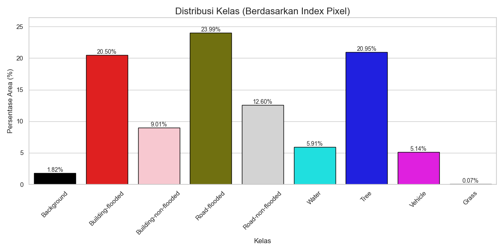

***

# Laporan Eksperimen Segmentasi Semantik Banjir

## 1. Deskripsi Dataset
Eksperimen ini menggunakan dataset lokal yang dikurasi khusus untuk studi kasus banjir di Indonesia.
* **Jumlah Data:** 144 citra (images).
* **Konteks:** Foto udara dan *street view* dari kejadian banjir nyata di Indonesia.
* **Anotasi:** Dilakukan secara manual (manual annotation) untuk memisahkan objek-objek penting dalam konteks bencana.

Berikut adalah visualisasi distribusi kelas dalam dataset beserta contoh citra yang digunakan:

## 2. Experimental Setup
Seluruh model dilatih dengan konfigurasi parameter umum sebagai berikut untuk memastikan perbandingan yang adil:

* **Image Input Size:** $512 \times 512$ pixel.
* **Batch Size:** 16.
    * SegFormer, PSPNet: 16.
    * CSDNet: 4.
    * Mask2Former: 2.
* **Epochs:** 25.
* **Optimizer:**
    * *PSPNet & SegFormer:* AdamW.
    * *Mask2Former:* AdamW (Learning Rate `1e-5`).
    * *CSDNet:* SGD (Momentum `0.9`).
* **Loss Function:** Menggunakan kombinasi Loss (seperti CrossEntropy + Dice Loss atau Focal Loss + Jaccard Loss) untuk menangani ketidakseimbangan kelas.

## 3. Model yang Diuji
Kami menguji empat arsitektur model berbeda untuk melihat efektivitasnya pada dataset kecil ini:
1.  **PSPNet:** Menggunakan *Pyramid Pooling Module* dengan backbone EfficientNet-B3.
2.  **SegFormer:** Model berbasis Transformer (*mit_b1*) yang ringan.
3.  **Mask2Former:** Arsitektur *Masked-attention Mask Transformer* dengan backbone Swin-Large (SOTA).
4.  **CSDNet:** Arsitektur kustom (*Context-Sensitive De-raining/Detection*) dengan modul *Targeted Enhancement* dan *Multi-Scale Fusion*.

## 4. Hasil Performa
Berikut adalah tabel perbandingan performa.

| Model Name | Background | Bld. Flooded | Bld. Non-Flood | Road Flooded | Road Non-Flood | Water | Tree | Vehicle | Grass | **mIoU** |
| :--- | :---: | :---: | :---: | :---: | :---: | :---: | :---: | :---: | :---: | :---: |
| **SegFormer (B1)** | 0.3231 | 0.7920 | 0.7032 | 0.3959 | 0.3186 | 0.2720 | 0.6038 | 0.1073 | 0.6752 | **0.4657** |
| **PSPNet** | 0.0420 | 0.5976 | 0.4216 | 0.3062 | 0.2277 | 0.2277 | 0.4110 | 0.0923 | 0.1592 | **0.2761** |
| **CSDNet** | 0.2548 | 0.7821 | 0.6826 | 0.3110 | 0.2682 | 0.2146 | 0.5634 | 0.0910 | 0.6843 | **0.4280** |
| **Mask2Former** | 0.3800 | 0.8181 | 0.7007 | 0.4822 | 0.3637 | 0.4653 | 0.6470 | 0.1293 | 0.7511 | **0.5264** |

Untuk memberikan gambaran kualitatif, berikut adalah visualisasi hasil prediksi dari model-model tersebut pada skenario ini:
